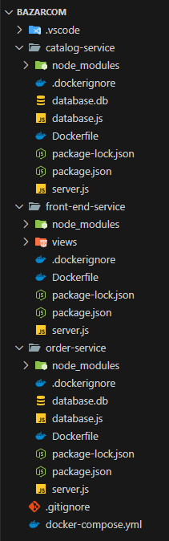

## Introduction
- Bazar.com is an online book store than enables you to search for books and purchase them. 

## Design 
- This project is built on microservices. It has 3 services running on separate servers : catalog , order , and frontend service.
- This design incrases modularity and scalability.

- the project structure looks like this : 

  

## Tech
- NodeJS runtime and ExpressJS web framework.
- SQLite lightweight database.
- Docker for containerization.
  
## Communication and Processing
- The front-end service is the API gateway. It receives the user requests on port 3002, and then redirects them to the other servers.
- If the request is a search query, it's redirected to the catalog server running on port 3000.
- If the request is a purchase, it's redirected to the order server running on port 3001.
- The order server comminucates with the catalog server to check the stock.
- The servers communicate with each other using Axios library.

## API Endpoints

- The available endpoints are documented on Postman using this link :
  https://documenter.getpostman.com/view/33019088/2sAY4si4KE

## Running The App
