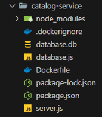
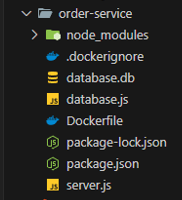
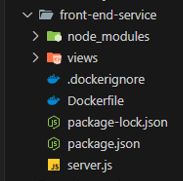
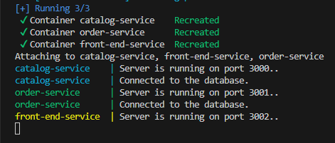

## Introduction
- Bazar.com is an online book store than enables you to search for books and purchase them. 

## Design 
- This project is built on microservices. It has 3 services running on separate servers : catalog , order , and frontend service.
- This design incrases modularity and scalability.

- the project structure looks like this : 

       

## Tech
- NodeJS runtime and ExpressJS web framework.
- SQLite lightweight database.
- Docker for containerization.
  
## Communication and Processing
- The front-end service is the API gateway. It receives the user requests on port 3002, and then redirects them to the other servers.
- If the request is a search query, it's redirected to the catalog server running on port 3000.
- If the request is a purchase, it's redirected to the order server running on port 3001.
- The order server comminucates with the catalog server to check the stock.
- The servers communicate with each other using Axios library.


## API Endpoints

- The available endpoints are documented on Postman using this link :
  https://documenter.getpostman.com/view/33019088/2sAY4si4KE


## Running The App
1. Clone the repository into your local machine on VSCode.
 ```bash
git clone https://github.com/MahmoudShouli/Bazarcom.git
cd Bazarcom
```

2. If the database.db files are empty, go to the /catalog-service/database.js and uncomment from line 14 to line 62 and /order-service/database.js from line 14 to 29. But after that comment them again when you run the app.


3. Make sure to install WSL and Docker Desktop on your machine.


4. Make sure you are in the repo directory.


5. Open VSCode Terminal


6. Type :
 ```bash
   docker-compose up
 ```


7. Now if everything works fine you should see something like this :

    


8. Naviagte to http://localhost:3002/ and the Bazar web page should appear.


* If it doesn't work go over the steps again and make sure you did everything right, make sure you have Node , WSL , and Docker installed, and more importantly make sure you are in the same directory as the docker-compose.yml file.

## Output
- You can find the output in the docs directory.


   
